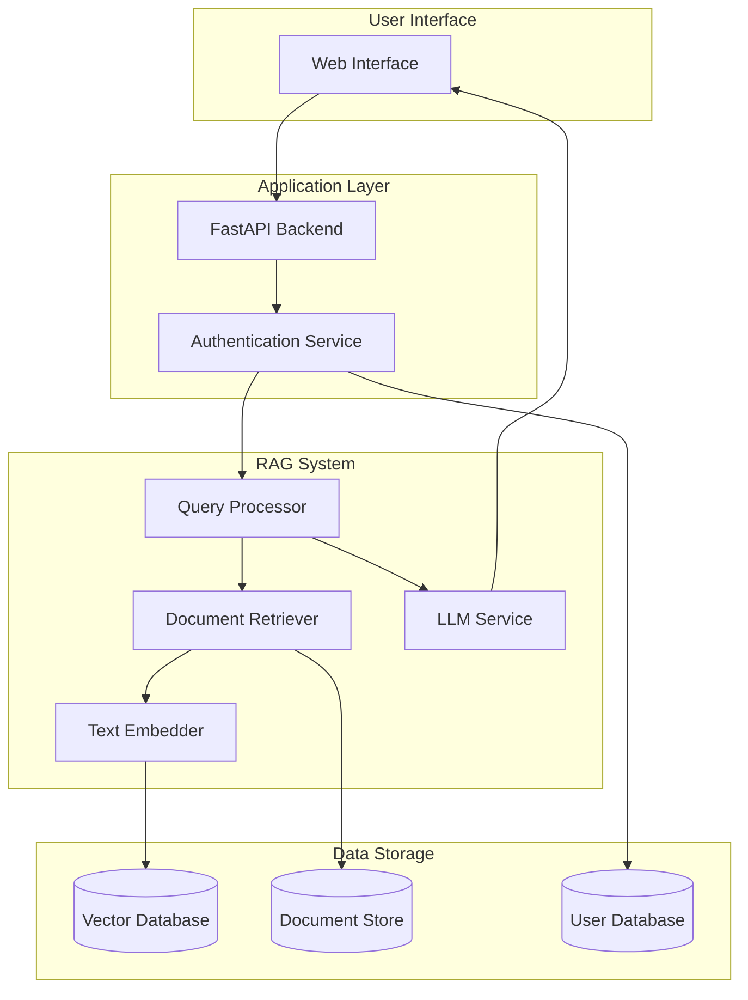

# System Architecture Documentation

## Current State Architecture



## Future State Architecture (With Fine-tuning)

```mermaid
graph TB
    subgraph "User Interface"
        UI[Web Interface]
        Analytics[User Analytics Dashboard]
    end

    subgraph "Application Layer"
        API[FastAPI Backend]
        Auth[Authentication Service]
        Monitoring[System Monitoring]
    end

    subgraph "RAG System"
        Query[Query Processor]
        Retriever[Document Retriever]
        Embedder[Text Embedder]
        LLM[LLM Service]
    end

    subgraph "Fine-tuning System"
        DataCollector[User Interaction Collector]
        DataProcessor[Data Processing Pipeline]
        ModelTrainer[Model Training Service]
        ModelRegistry[Model Registry]
        A/B Testing[A/B Testing Service]
    end

    subgraph "Data Storage"
        VectorDB[(Vector Database)]
        DocDB[(Document Store)]
        UserDB[(User Database)]
        InteractionDB[(Interaction Database)]
        ModelDB[(Model Database)]
    end

    %% User Interface Connections
    UI --> API
    UI --> Analytics
    Analytics --> Monitoring

    %% Application Layer Connections
    API --> Auth
    Auth --> Query
    Auth --> UserDB

    %% RAG System Connections
    Query --> Retriever
    Retriever --> Embedder
    Embedder --> VectorDB
    Retriever --> DocDB
    Query --> LLM
    LLM --> UI

    %% Fine-tuning System Connections
    UI --> DataCollector
    DataCollector --> InteractionDB
    InteractionDB --> DataProcessor
    DataProcessor --> ModelTrainer
    ModelTrainer --> ModelRegistry
    ModelRegistry --> A/B Testing
    A/B Testing --> LLM
    ModelRegistry --> ModelDB

    %% Monitoring Connections
    Monitoring --> DataCollector
    Monitoring --> ModelTrainer
    Monitoring --> LLM
```

## Component Descriptions

### Current State Components

1. **User Interface**
   - Web-based interface for user interactions
   - Handles user input and displays responses

2. **Application Layer**
   - FastAPI Backend: Main application server
   - Authentication Service: Handles user authentication and authorization

3. **RAG System**
   - Query Processor: Processes user queries
   - Document Retriever: Retrieves relevant documents
   - Text Embedder: Generates embeddings for text
   - LLM Service: Processes queries and generates responses

4. **Data Storage**
   - Vector Database: Stores document embeddings
   - Document Store: Stores original documents
   - User Database: Stores user information

### Future State Components

1. **Enhanced User Interface**
   - Web Interface: Improved with analytics capabilities
   - User Analytics Dashboard: For monitoring system performance

2. **Enhanced Application Layer**
   - FastAPI Backend: Extended with new endpoints
   - Authentication Service: Enhanced security features
   - System Monitoring: Real-time system health monitoring

3. **RAG System**
   - Same as current state with improved integration

4. **Fine-tuning System**
   - User Interaction Collector: Gathers user behavior data
   - Data Processing Pipeline: Processes and prepares training data
   - Model Training Service: Handles model fine-tuning
   - Model Registry: Manages model versions
   - A/B Testing Service: Tests new model versions

5. **Enhanced Data Storage**
   - All current state databases
   - Interaction Database: Stores user interaction data
   - Model Database: Stores fine-tuned model versions

## Data Flow

### Current State Flow
1. User submits query through UI
2. Query is authenticated and processed
3. Relevant documents are retrieved
4. LLM generates response
5. Response is returned to user

### Future State Flow
1. User submits query through UI
2. Query is authenticated and processed
3. User interaction is collected
4. Relevant documents are retrieved
5. LLM generates response
6. Response is returned to user
7. User feedback is collected
8. Data is processed for fine-tuning
9. New model versions are tested
10. Successful models are deployed

## Security Considerations

1. **Data Privacy**
   - User data anonymization
   - Secure storage of interactions
   - Compliance with data protection regulations

2. **Model Security**
   - Secure model storage
   - Access control for model versions
   - Regular security audits

3. **System Security**
   - API authentication
   - Rate limiting
   - Input validation
   - Regular security updates

## Monitoring and Maintenance

1. **System Health**
   - Real-time performance monitoring
   - Error tracking and alerting
   - Resource usage monitoring

2. **Model Performance**
   - Response quality metrics
   - User satisfaction tracking
   - Model drift detection

3. **Data Quality**
   - Training data quality checks
   - Data pipeline monitoring
   - Regular data cleanup

## Scaling Considerations

1. **Horizontal Scaling**
   - Load balancing
   - Distributed processing
   - Database sharding

2. **Vertical Scaling**
   - Resource optimization
   - Cache management
   - Query optimization

3. **Cost Management**
   - Resource usage monitoring
   - Cost optimization strategies
   - Budget controls 