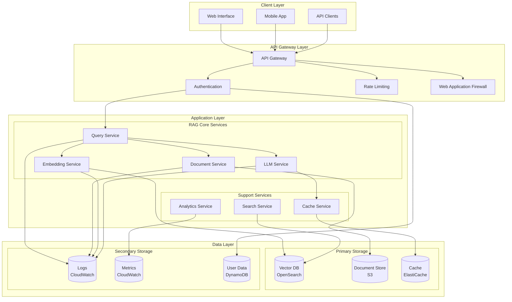
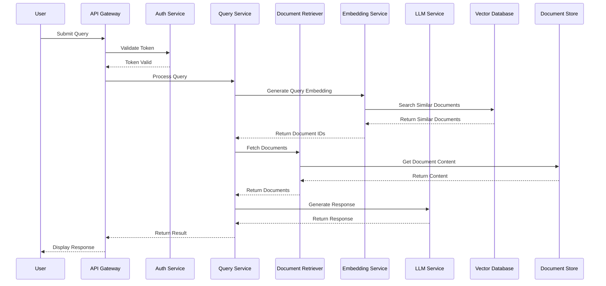
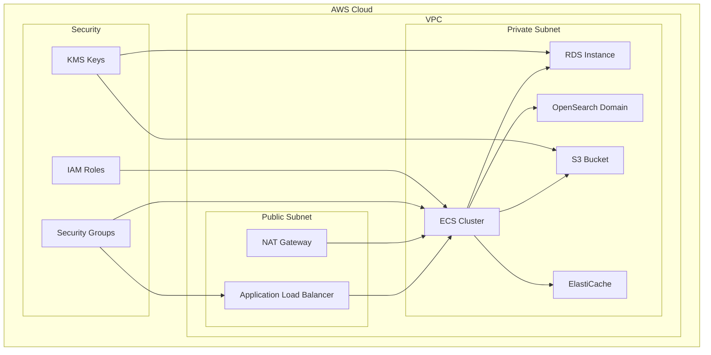
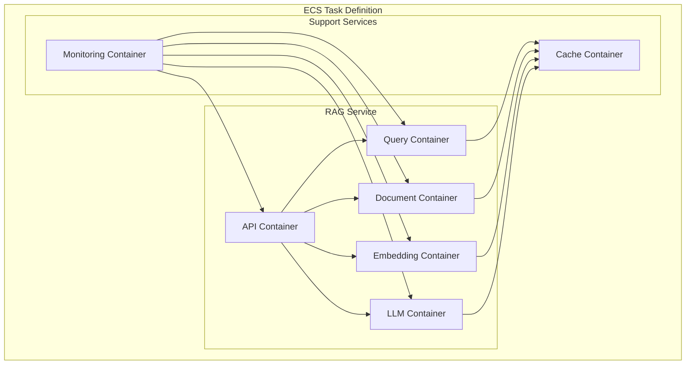

# AWS RAG System - Detailed Design Document

## 1. Solution Architecture

### 1.1 High-Level Architecture Diagram



### 1.2 Component Interaction Sequence



## 2. Low-Level Design

### 2.1 Core Components

#### 2.1.1 Query Service
```python
class QueryService:
    def __init__(self):
        self.embedding_service = EmbeddingService()
        self.document_service = DocumentService()
        self.llm_service = LLMService()
        self.cache_service = CacheService()

    async def process_query(self, query: str, context: Dict[str, Any]) -> QueryResponse:
        # 1. Check cache
        cached_response = await self.cache_service.get(query)
        if cached_response:
            return cached_response

        # 2. Generate query embedding
        query_embedding = await self.embedding_service.generate_embedding(query)

        # 3. Retrieve relevant documents
        documents = await self.document_service.retrieve_documents(
            query_embedding,
            max_results=5
        )

        # 4. Generate response using LLM
        response = await self.llm_service.generate_response(
            query=query,
            context=documents,
            user_context=context
        )

        # 5. Cache response
        await self.cache_service.set(query, response)

        return response
```

#### 2.1.2 Document Service
```python
class DocumentService:
    def __init__(self):
        self.vector_store = VectorStore()
        self.document_store = DocumentStore()
        self.embedding_service = EmbeddingService()

    async def process_document(self, document: Document) -> str:
        # 1. Generate document chunks
        chunks = self.chunk_document(document)

        # 2. Generate embeddings for chunks
        embeddings = await self.embedding_service.generate_embeddings(chunks)

        # 3. Store in vector database
        vector_ids = await self.vector_store.store_vectors(embeddings)

        # 4. Store original document
        doc_id = await self.document_store.store_document(document)

        # 5. Create mapping between chunks and document
        await self.create_chunk_mapping(vector_ids, doc_id)

        return doc_id

    async def retrieve_documents(
        self,
        query_embedding: List[float],
        max_results: int = 5
    ) -> List[Document]:
        # 1. Search vector store
        similar_vectors = await self.vector_store.search(
            query_embedding,
            max_results=max_results
        )

        # 2. Get document IDs
        doc_ids = await self.get_document_ids(similar_vectors)

        # 3. Retrieve documents
        documents = await self.document_store.get_documents(doc_ids)

        return documents
```

#### 2.1.3 Embedding Service
```python
class EmbeddingService:
    def __init__(self):
        self.model = self.load_embedding_model()
        self.cache = EmbeddingCache()

    async def generate_embedding(self, text: str) -> List[float]:
        # 1. Check cache
        cached_embedding = await self.cache.get(text)
        if cached_embedding:
            return cached_embedding

        # 2. Generate embedding
        embedding = await self.model.encode(text)

        # 3. Cache embedding
        await self.cache.set(text, embedding)

        return embedding

    async def generate_embeddings(self, texts: List[str]) -> List[List[float]]:
        # Batch process embeddings
        embeddings = await self.model.encode_batch(texts)
        return embeddings
```

#### 2.1.4 LLM Service
```python
class LLMService:
    def __init__(self):
        self.model = self.load_llm_model()
        self.prompt_template = self.load_prompt_template()

    async def generate_response(
        self,
        query: str,
        context: List[Document],
        user_context: Dict[str, Any]
    ) -> str:
        # 1. Prepare prompt
        prompt = self.prompt_template.format(
            query=query,
            context=context,
            user_context=user_context
        )

        # 2. Generate response
        response = await self.model.generate(prompt)

        # 3. Post-process response
        processed_response = self.post_process_response(response)

        return processed_response
```

### 2.2 Data Models

#### 2.2.1 Document Model
```python
@dataclass
class Document:
    id: str
    content: str
    metadata: Dict[str, Any]
    created_at: datetime
    updated_at: datetime
    embedding_id: Optional[str] = None
```

#### 2.2.2 Query Model
```python
@dataclass
class Query:
    id: str
    text: str
    user_id: str
    created_at: datetime
    context: Dict[str, Any]
```

#### 2.2.3 Response Model
```python
@dataclass
class QueryResponse:
    id: str
    query_id: str
    response: str
    sources: List[Document]
    created_at: datetime
    metadata: Dict[str, Any]
```

### 2.3 Storage Layer

#### 2.3.1 Vector Store Interface
```python
class VectorStore:
    async def store_vectors(
        self,
        vectors: List[List[float]],
        metadata: Optional[List[Dict[str, Any]]] = None
    ) -> List[str]:
        pass

    async def search(
        self,
        query_vector: List[float],
        max_results: int = 5
    ) -> List[Dict[str, Any]]:
        pass

    async def delete_vectors(self, vector_ids: List[str]) -> bool:
        pass
```

#### 2.3.2 Document Store Interface
```python
class DocumentStore:
    async def store_document(self, document: Document) -> str:
        pass

    async def get_document(self, doc_id: str) -> Document:
        pass

    async def get_documents(self, doc_ids: List[str]) -> List[Document]:
        pass

    async def delete_document(self, doc_id: str) -> bool:
        pass
```

### 2.4 Error Handling

```python
class RAGError(Exception):
    def __init__(
        self,
        message: str,
        error_code: str,
        details: Optional[Dict[str, Any]] = None
    ):
        self.message = message
        self.error_code = error_code
        self.details = details or {}
        super().__init__(self.message)

class DocumentProcessingError(RAGError):
    pass

class EmbeddingError(RAGError):
    pass

class QueryProcessingError(RAGError):
    pass

class LLMError(RAGError):
    pass
```

### 2.5 Configuration

```python
@dataclass
class RAGConfig:
    # Vector Store Configuration
    vector_store_type: str = "opensearch"
    vector_store_endpoint: str
    vector_store_index: str
    vector_dimension: int = 1536

    # Document Store Configuration
    document_store_type: str = "s3"
    document_store_bucket: str
    document_store_prefix: str

    # LLM Configuration
    llm_model: str = "gpt-4"
    llm_temperature: float = 0.7
    llm_max_tokens: int = 1000

    # Embedding Configuration
    embedding_model: str = "text-embedding-ada-002"
    embedding_batch_size: int = 100

    # Cache Configuration
    cache_type: str = "redis"
    cache_endpoint: str
    cache_ttl: int = 3600

    # API Configuration
    api_rate_limit: int = 100
    api_timeout: int = 30
```

## 3. Deployment Architecture

### 3.1 Infrastructure Components



### 3.2 Container Architecture



## 4. Security Considerations

### 4.1 Authentication and Authorization
- JWT-based authentication
- Role-based access control (RBAC)
- API key management
- AWS IAM integration

### 4.2 Data Security
- Encryption at rest (KMS)
- Encryption in transit (TLS)
- Data anonymization
- Access logging

### 4.3 Network Security
- VPC configuration
- Security groups
- Network ACLs
- WAF rules

## 5. Monitoring and Observability

### 5.1 Metrics
- Request latency
- Error rates
- Cache hit rates
- Resource utilization
- Cost metrics

### 5.2 Logging
- Application logs
- Access logs
- Error logs
- Audit logs

### 5.3 Alerts
- Error rate thresholds
- Latency thresholds
- Resource utilization
- Cost thresholds

## 6. Scaling Strategy

### 6.1 Horizontal Scaling
- ECS auto-scaling
- Read replicas
- Cache clusters
- Load balancing

### 6.2 Vertical Scaling
- Instance type selection
- Memory optimization
- CPU optimization
- Storage optimization

### 6.3 Cost Optimization
- Reserved instances
- Spot instances
- Auto-scaling policies
- Resource cleanup 